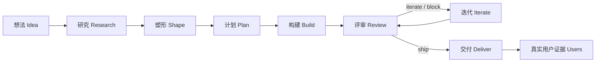

<div align="center">


# Your ByteDance Skills

**你自己的产品小队，把一个想法持续推进到可交付产品。**

[中文](README.md) · [English](README_en.md)

[](https://github.com/elan6666/your-bytedance-skills/stargazers)
[](https://github.com/elan6666/your-bytedance-skills/commits/main)


</div>

<table>
  <tr>
    <td align="center"><strong>🎯 从想法到范围</strong><br/>讨论需求、研究市场、定义 MVP</td>
    <td align="center"><strong>🧭 上下文先行</strong><br/>OKR、决策、证据和状态都写入文件</td>
    <td align="center"><strong>⚙️ 按波次执行</strong><br/>依赖就绪的计划可安全并行推进</td>
    <td align="center"><strong>🔁 评审再迭代</strong><br/>验证、复审、修复，直到可以交付</td>
  </tr>
</table>

## 项目简介

**Your ByteDance Skills** 是一套面向 Codex 的产品开发工作流。它把产品、市场研究、UX、工程、QA、增长和交付组织成 17 个可组合的 `byte-*` skills，并用 `.byte-os/` 保存共享上下文。

它不是一个只会生成计划的提示词集合。`byte-auto` 会持续执行 **研究 → 塑形 → 计划 → 构建 → 评审 → 迭代 → 交付**，直到完成条件满足或遇到真正需要用户处理的硬阻塞。

> ByteDance-inspired, not ByteDance-official. 本项目与字节跳动没有隶属或官方关系。

## 快速开始

```bash
git clone https://github.com/elan6666/your-bytedance-skills.git
cd your-bytedance-skills
cp -R byte-* ~/.codex/skills/
```

Windows 用户将所有 `byte-*` 文件夹复制到：

```text
C:\Users\<you>\.codex\skills\
```

重启 Codex 后，直接用自然语言调用总入口：

```text
$byte-do 我想做一个面向大学生的 AI 学习助手
```

或者一键执行完整流程：

```text
$byte-auto Build a web app for solo founders to validate product ideas.
```

以后更新本地 skills：

```bash
git pull
cp -R byte-* ~/.codex/skills/
```

## 两种工作方式

| 模式 | 适合场景 | 调用方式 |
|---|---|---|
| **逐步模式** | 希望每个阶段自己确认 | `$byte-start` → `$byte-shape` → `$byte-plan` → `$byte-build` |
| **自动模式** | 已经明确目标，希望持续执行到交付 | `$byte-auto <目标>` |



自动模式默认进行 3 轮证据驱动迭代；如果用户明确给出正整数轮数，则尊重该数量。无论轮数多少，验证和最新评审仍必须通过。

## Skill 地图

### 发现与定义

| Skill | 作用 |
|---|---|
| [`byte-do`](byte-do/SKILL.md) | 自然语言总入口；根据意图和项目状态选择并执行工作流 |
| [`byte-brainstorm`](byte-brainstorm/SKILL.md) | 显式调用的发散模式，不自动进入正式流程 |
| [`byte-discuss`](byte-discuss/SKILL.md) | 澄清需求、范围、非目标和风险，不写产品代码 |
| [`byte-start`](byte-start/SKILL.md) | 初始化 `.byte-os/`、目标、假设、决策和基础研究 |
| [`byte-research`](byte-research/SKILL.md) | 搜索竞品、定价、趋势、替代方案和用户抱怨 |
| [`byte-shape`](byte-shape/SKILL.md) | 定义定位、MVP、用户流程、UX、技术方向和路线图 |

### 计划与构建

| Skill | 作用 |
|---|---|
| [`byte-codebase-harness`](byte-codebase-harness/SKILL.md) | 为现有代码库建立 Claude/Codex 导航和验证上下文 |
| [`byte-plan`](byte-plan/SKILL.md) | 把规格拆成带依赖、验收标准和验证步骤的计划 |
| [`byte-build`](byte-build/SKILL.md) | 按 dependency-ready waves 执行计划 |
| [`byte-code-rules`](byte-code-rules/SKILL.md) | 约束代码改动保持简单、克制、可追踪、可验证 |

### 评审与交付

| Skill | 作用 |
|---|---|
| [`byte-review`](byte-review/SKILL.md) | 产品、UX、技术、QA、增长的跨职能质量门 |
| [`byte-iterate`](byte-iterate/SKILL.md) | 根据评审、测试、研究或真实反馈进行迭代 |
| [`byte-deliver`](byte-deliver/SKILL.md) | 生成运行方式、验证结果、风险和最终交付说明 |
| [`byte-users`](byte-users/SKILL.md) | 只分析真实的产品后用户证据，不模拟用户 |

### 编排与状态

| Skill | 作用 |
|---|---|
| [`byte-next`](byte-next/SKILL.md) | 根据共享状态推进一个阶段 |
| [`byte-status`](byte-status/SKILL.md) | 汇总进度、计划、评审、阻塞和下一步 |
| [`byte-auto`](byte-auto/SKILL.md) | 从想法持续执行到可交付结果 |

## Byte OS 状态

工作流把项目上下文保存在项目根目录的 `.byte-os/` 中。这里是项目事实源，不是临时聊天记录。

<details>
<summary><strong>查看目录结构</strong></summary>

```text
.byte-os/
  BYTE.md               # 产品和成功标准
  STATUS.md             # 当前阶段与下一步
  OKRS.md               # Objective 与 Key Results
  DECISIONS.md          # 决策和假设
  RESEARCH.md           # 市场研究
  COMPETITORS.md        # 竞品比较
  USER_ASSUMPTIONS.md   # 待验证的用户假设
  PRODUCT_SPEC.md       # 产品规格
  UX_SPEC.md            # 用户体验规格
  TECH_SPEC.md          # 技术规格
  CODEBASE_MAP.md       # 代码库地图
  HARNESS.md            # 验证和导航上下文
  ROADMAP.md            # 路线图
  BUILD_LOG.md          # 构建记录
  DELIVERY.md           # 交付说明
  plans/                # 可执行计划
  reviews/              # 评审记录
  iterations/           # 迭代记录
  users/                # 真实用户证据
  subagents/            # 子代理交接记录
```

</details>

`byte-do/references/state-contract.md` 定义统一生命周期，`byte-do/scripts/byte_state.py` 负责扫描、路由、校验和更新状态。`byte-do`、`byte-next`、`byte-status` 和 `byte-auto` 使用同一解析器，避免多个路由表逐渐不一致。

```bash
python3 byte-do/scripts/byte_state.py scan --root /path/to/project
python3 byte-do/scripts/byte_state.py next --root /path/to/project
python3 byte-do/scripts/byte_state.py validate --root /path/to/project
```

## 核心原则

- **Always Day 1：** 保持速度、简单和学习能力。
- **Context, not control：** 把状态、证据、决策和下一步写进文件。
- **Candid and clear：** 明确区分事实、假设和观点，直接暴露问题。
- **Seek truth：** 市场结论使用当前来源，工程结论使用测试和验证。
- **Aim high with ROI：** 追求高标准，但不做低价值忙碌工作。
- **Experimentation culture：** 把不确定选择转成假设、指标和实验。

## 重要边界

- `byte-users` 只处理真实用户证据，不会模拟访谈或编造反馈。
- 现代竞品、价格、趋势和 “latest” 信息必须联网核实并引用来源。
- 现有仓库或大型 monorepo 应先运行 `byte-codebase-harness`。
- Subagent 只用于清晰、隔离、可验证的任务；主 agent 保留合并和最终验证责任。
- 自动模式不会把普通测试失败或评审问题当作停止理由，而会修复、重规划并复审。

## 验证

```bash
python3 -m unittest discover -s tests -v
```

当前仓库包含 **17 个状态转移回归测试**，覆盖旧格式兼容、harness 路由、计划状态、评审新鲜度、迭代复审、硬阻塞和交付判断。

## 公开资料依据

- [ByteDance Culture](https://joinbytedance.com/culture)
- [Lark OKR](https://www.larksuite.com/product/okr)
- [Anthropic: How Claude Code works in large codebases](https://claude.com/blog/how-claude-code-works-in-large-codebases-best-practices-and-where-to-start)
- [forrestchang/andrej-karpathy-skills](https://github.com/forrestchang/andrej-karpathy-skills)

---

<div align="center">

如果这个项目对你有帮助，欢迎点一个 ⭐️。

**Your own ByteDance, powered by Codex skills.**

</div>
