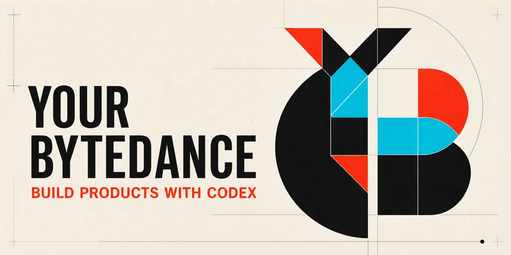

# Your ByteDance Skills



你自己的产品团队，powered by Codex skills。

> 受字节跳动工作方式启发，并非字节跳动官方项目，也与字节跳动无隶属关系。

Your ByteDance 是一组轻量 Codex skills，用来讨论、研究、规划、构建、评审和完成产品工作。它不要求每个项目遵循固定流水线，而是让模型根据目标、风险和实时证据选择真正有用的步骤。

## 核心理念

- **结果优先**：完成用户要的结果，而不是完成流程。
- **模型自主判断**：研究、计划、文档和迭代深度由任务决定。
- **最小必要流程**：简单任务直接完成，复杂任务才增加结构。
- **真实证据**：代码、测试、运行状态、当前来源和真实反馈优先于状态叙述。
- **自动复盘**：把已证实的错误和需求误解沉淀成可复用的预防规则。
- **诚实交付**：明确验证结果、假设、失败和剩余限制。

不再默认要求：固定阶段、三轮迭代、OKR、角色扮演、完整 `.byte-os` 文档集、Harness 门禁或多文件计划。

## 安装

```bash
git clone https://github.com/elan6666/your-bytedance-skills.git
cd your-bytedance-skills
cp -R byte-* ~/.codex/skills/
```

如果安装过旧版，请另外删除已废弃的旧 skill 目录；仅复制新版不会自动删除旧目录。

## 快速使用

让系统选择合适方式：

```text
$byte-do 帮我把这个产品想法推进到下一步
```

端到端完成：

```text
$byte-auto 构建一个可运行的 AI 学习助手并完成验证
```

也可以直接调用一个具体能力：

```text
$byte-discuss 讨论这个产品的 MVP 边界
$byte-research 比较当前竞品和定价
$byte-plan 为这个改动制定合适深度的计划
$byte-build 实现并验证这个功能
$byte-review 审查当前实现的关键问题
$byte-status 核实项目真实进度
```

## Skills

| Skill | 作用 |
|---|---|
| [`byte-do`](byte-do/SKILL.md) | 自适应入口：理解意图并选择最小有用流程 |
| [`byte-auto`](byte-auto/SKILL.md) | 对最终结果负责，自主执行到验证完成或真实阻塞 |
| [`byte-discuss`](byte-discuss/SKILL.md) | 自然讨论需求、方向和重要权衡 |
| [`byte-research`](byte-research/SKILL.md) | 研究会影响决策的当前证据 |
| [`byte-plan`](byte-plan/SKILL.md) | 按任务复杂度制定执行计划 |
| [`byte-build`](byte-build/SKILL.md) | 实现聚焦改动并做相称验证 |
| [`byte-review`](byte-review/SKILL.md) | 基于真实产物和证据识别关键问题 |
| [`byte-status`](byte-status/SKILL.md) | 核实已完成、未知、阻塞与下一步 |
| [`byte-brainstorm`](byte-brainstorm/SKILL.md) | 生成并比较真正不同的方向 |
| [`byte-future`](byte-future/SKILL.md) | 记录以后再做的想法，不扩大当前范围 |

## 自适应工作方式

`byte-auto` 不再运行固定的 `start → research → shape → plan → build → review → iterate → deliver` 流水线。它会循环执行真正有价值的动作：

1. 检查当前文件、运行状态、证据和已有工作。
2. 判断最能推进目标的下一步。
3. 按需研究、规划、实现或评审。
4. 根据风险进行验证。
5. 修复重要问题，重新判断是否完成。

小任务可能一次完成；复杂任务可能需要多次迭代。停止条件是结果和验证，而不是固定次数。

## 项目状态

`.byte-os/` 是可选工具，不是前置条件。只有长周期或需要跨会话恢复的项目才建议写状态；默认使用一个简洁的 `.byte-os/STATE.md`，记录目标、事实、决策、完成工作、验证、阻塞和下一步即可。

### 自动错题本

当用户纠正了模型对需求的重要误解，或者测试、运行结果等直接证据确认了一个有复用价值的错误时，skills 会自动创建或更新 `.byte-os/LESSONS.md`。每条记录包含：

- 当时的场景；
- 犯过的错或错误理解；
- 正确理解与证据；
- 下次如何避免。

开始相关工作时会先读取有效教训。相同错误再次发生时更新原条目，而不是重复添加。普通探索失败、临时调试、模糊自我批评、秘密和敏感用户数据不会写入错题本。

已有旧版 `.byte-os` 文件可以继续作为项目证据读取，不需要补齐缺失文档，也不会强制项目回到旧生命周期。

## 旧命令迁移

为减少重复和上下文负担，以下旧入口已经移除：

| 旧 skill | 现在使用 |
|---|---|
| `byte-start`, `byte-shape` | `byte-discuss`, `byte-plan`, `byte-do` |
| `byte-iterate`, `byte-deliver` | `byte-auto`, `byte-build` |
| `byte-next` | `byte-do`, `byte-status` |
| `byte-users` | `byte-research`, `byte-review` |
| `byte-code-rules` | 已合并进 `byte-build` 和共享原则 |
| `byte-codebase-harness` | 按需由 `byte-plan`/`byte-build` 创建必要上下文 |

## 说明

产品、商标和公司名称归各自权利人所有。

English documentation: [README_en.md](README_en.md)
