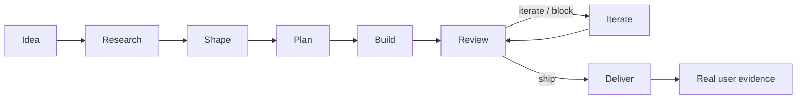

<div align="center">


# Your ByteDance Skills

**Your own product squad, moving an idea all the way to a deliverable product.**

[中文](README.md) · [English](README_en.md)

[](https://github.com/elan6666/your-bytedance-skills/stargazers)
[](https://github.com/elan6666/your-bytedance-skills/commits/main)


</div>

<table>
  <tr>
    <td align="center"><strong>🎯 Idea to scope</strong><br/>Clarify needs, research the market, define the MVP</td>
    <td align="center"><strong>🧭 Context first</strong><br/>Keep OKRs, decisions, evidence, and state in files</td>
    <td align="center"><strong>⚙️ Wave execution</strong><br/>Run dependency-ready plans safely in parallel</td>
    <td align="center"><strong>🔁 Review and iterate</strong><br/>Verify, review, repair, and ship</td>
  </tr>
</table>

## Overview

**Your ByteDance Skills** is a product-development workflow for Codex. It organizes product, market research, UX, engineering, QA, growth, and delivery into 18 composable `byte-*` skills, with shared context stored in `.byte-os/`.

This is not a prompt collection that stops after producing a plan. `byte-auto` keeps running **research → shape → plan → build → review → iterate → deliver** until the completion gates pass or a genuine hard blocker requires user action.

> ByteDance-inspired, not ByteDance-official. This project is not affiliated with ByteDance.

## Quick Start

```bash
git clone https://github.com/elan6666/your-bytedance-skills.git
cd your-bytedance-skills
cp -R byte-* ~/.codex/skills/
```

On Windows, copy all `byte-*` directories to:

```text
C:\Users\<you>\.codex\skills\
```

Restart Codex, then use the natural-language router:

```text
$byte-do I want to build an AI study assistant for university students
```

Or run the complete workflow:

```text
$byte-auto Build a web app for solo founders to validate product ideas.
```

To update your installed skills later:

```bash
git pull
cp -R byte-* ~/.codex/skills/
```

## Two Ways to Work

| Mode | Best for | Invocation |
|---|---|---|
| **Step by step** | You want to confirm each product stage | `$byte-start` → `$byte-shape` → `$byte-plan` → `$byte-build` |
| **Automatic** | The outcome is clear and execution should continue to delivery | `$byte-auto <goal>` |



Auto mode defaults to three evidence-led iterations. When the user explicitly supplies a positive count, that count is respected. Verification and a current review are still required regardless of iteration count.

## Skill Map

### Discover and Define

| Skill | Purpose |
|---|---|
| [`byte-do`](byte-do/SKILL.md) | Natural-language front door that selects and executes the right workflow |
| [`byte-brainstorm`](byte-brainstorm/SKILL.md) | Explicit-only divergent ideation outside the committed workflow |
| [`byte-future`](byte-future/SKILL.md) | Park ideas for later without adding them to goals, plans, or auto completion tracking |
| [`byte-discuss`](byte-discuss/SKILL.md) | Clarify requirements, scope, non-goals, and risks without writing product code |
| [`byte-start`](byte-start/SKILL.md) | Initialize `.byte-os/`, goals, assumptions, decisions, and foundation context |
| [`byte-research`](byte-research/SKILL.md) | Research competitors, pricing, trends, substitutes, and user complaints |
| [`byte-shape`](byte-shape/SKILL.md) | Define positioning, MVP, user flow, UX, technical direction, and roadmap |

### Plan and Build

| Skill | Purpose |
|---|---|
| [`byte-codebase-harness`](byte-codebase-harness/SKILL.md) | Build Claude/Codex navigation and verification context for an existing codebase |
| [`byte-plan`](byte-plan/SKILL.md) | Turn specs into dependency-aware plans with acceptance and verification |
| [`byte-build`](byte-build/SKILL.md) | Execute dependency-ready plans by wave |
| [`byte-code-rules`](byte-code-rules/SKILL.md) | Keep code changes simple, surgical, traceable, and verifiable |

### Review and Deliver

| Skill | Purpose |
|---|---|
| [`byte-review`](byte-review/SKILL.md) | Cross-functional product, UX, engineering, QA, and growth quality gate |
| [`byte-iterate`](byte-iterate/SKILL.md) | Iterate from review findings, tests, research, or real feedback |
| [`byte-deliver`](byte-deliver/SKILL.md) | Package run instructions, verification, risks, and final handoff |
| [`byte-users`](byte-users/SKILL.md) | Analyze real post-build user evidence only; never simulate users |

### Orchestration and State

| Skill | Purpose |
|---|---|
| [`byte-next`](byte-next/SKILL.md) | Advance one stage from shared state |
| [`byte-status`](byte-status/SKILL.md) | Summarize progress, plans, reviews, blockers, and the next action |
| [`byte-auto`](byte-auto/SKILL.md) | Continue from idea to a deliverable result |

## Byte OS State

The workflow stores project context in `.byte-os/` at the project root. This is the project source of truth, not disposable chat history.

<details>
<summary><strong>View the directory structure</strong></summary>

```text
.byte-os/
  BYTE.md               # Product and success criteria
  STATUS.md             # Current stage and next action
  OKRS.md               # Objective and Key Results
  DECISIONS.md          # Decisions and assumptions
  RESEARCH.md           # Market research
  COMPETITORS.md        # Competitor comparison
  USER_ASSUMPTIONS.md   # User assumptions to validate
  PRODUCT_SPEC.md       # Product specification
  UX_SPEC.md            # User experience specification
  TECH_SPEC.md          # Technical specification
  CODEBASE_MAP.md       # Codebase map
  HARNESS.md            # Navigation and verification context
  ROADMAP.md            # Product roadmap
  BUILD_LOG.md          # Build record
  DELIVERY.md           # Delivery handoff
  FUTURE.md             # Parked future plans excluded from current completion
  plans/                # Executable plans
  reviews/              # Review records
  iterations/           # Iteration records
  users/                # Real user evidence
  subagents/            # Subagent handoffs
```

</details>

`byte-do/references/state-contract.md` defines the shared lifecycle. `byte-do/scripts/byte_state.py` scans, routes, validates, and updates state. `byte-do`, `byte-next`, `byte-status`, and `byte-auto` use the same resolver so their routing rules cannot silently drift apart.

```bash
python3 byte-do/scripts/byte_state.py scan --root /path/to/project
python3 byte-do/scripts/byte_state.py next --root /path/to/project
python3 byte-do/scripts/byte_state.py validate --root /path/to/project
```

## Operating Principles

- **Always Day 1:** preserve speed, simplicity, and learning.
- **Context, not control:** write state, evidence, decisions, and next actions into files.
- **Candid and clear:** separate facts, assumptions, and opinions; expose problems directly.
- **Seek truth:** use current sources for market claims and verification for engineering claims.
- **Aim high with ROI:** pursue a high bar without low-impact busywork.
- **Experimentation culture:** turn uncertain choices into hypotheses, metrics, and experiments.

## Important Boundaries

- `byte-users` accepts real user evidence only. It does not simulate interviews or invent feedback.
- `byte-future` records explicitly deferred ideas only; parked entries never block `byte-auto`, review, or delivery.
- Modern competitor, pricing, trend, and “latest” claims require current web research and citations.
- Existing repositories and large monorepos should run `byte-codebase-harness` first.
- Subagents are used only for isolated, verifiable scopes; the main agent retains merge and final verification ownership.
- Auto mode treats ordinary test failures and review findings as repair work, not reasons to stop.

## Validation

```bash
python3 -m unittest discover -s tests -v
```

The repository currently contains **20 state-transition regression tests** covering legacy state compatibility, harness routing, plan status, review freshness, post-iteration review, future-plan isolation, hard blockers, and delivery decisions.

## Public Research Basis

- [ByteDance Culture](https://joinbytedance.com/culture)
- [Lark OKR](https://www.larksuite.com/product/okr)
- [Anthropic: How Claude Code works in large codebases](https://claude.com/blog/how-claude-code-works-in-large-codebases-best-practices-and-where-to-start)
- [forrestchang/andrej-karpathy-skills](https://github.com/forrestchang/andrej-karpathy-skills)

---

<div align="center">

If this project is useful, consider giving it a ⭐️.

**Your own ByteDance, powered by Codex skills.**

</div>
